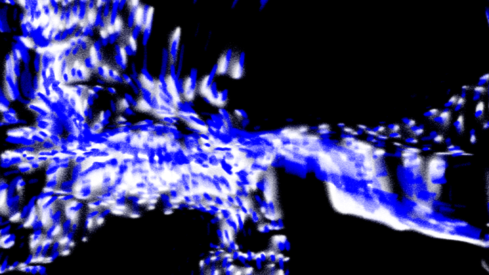

i’ve had ongoing collaborations with [rbma](http://redbullmusicacademy.com) since 2015, when I performed at the rbma fest in new york. the most recent of these, shattered streams, was an experiment in musical ephemerality, presenting original music from 31 artists throughout may 2016. each song was available to stream on a loop for a maximum period of 24 hours, degrading over that time until they simply disappeared.

this project wasn’t about digital v. analog, or suggesting one way of listening is purer than another. instead, it was a continuum of the conversations surrounding modern music consumption via streaming services in which a degradation of access, not quality, is encountered as the result of shifting licensing agreements and dropped connections.

the site made heavy use of the web audio api to handle real-time signal processing in the browser. users could select a listening session duration anywhere between a minute and twenty-four hours. it was important to communicate the idea of degradation without relying on analog auditory tropes like tape hiss.

the final chain relies upon several convolvers with extreme impulse reactions each phasing in and out of each other, along with eq modulation and a touch of distortion.

the audio stream was accompanied by 31 hand animated six frame loops which were fed through visual displacement and feedback processing, all of which was created by [andrew ohlmann](http://andrewohlmann.com). parameters were frequency-mapped to the audio being played to create an identifiable cohesion within the chaos.

the site was a frameworkless single page app. we relied on [browserify](http://browserify.org) to bundle everything up, and [pixi](http://www.pixijs.com) was heavily used for the stream visuals.

after the stream concluded, it was replaced by an archive page which is currently accessible by visiting [streams.redbullmusicacademy.com](http://streams.redbullmusicacademy.com).

special thanks to [brian allen simon](http://brianallensimon.com) for initiating the project, and [andrew ohlmann](http://andrewohlmann.com).

## participating artists

<ul class="tc2 columns ttl">
  <li>Anenon</li>
  <li>William Basinski</li>
  <li>Fatima Al Qadiri</li>
  <li>Eluvium</li>
  <li>Patten</li>
  <li>Joey Anderson</li>
  <li>Claude Speeed</li>
  <li>White Visitation</li>
  <li>Fennesz</li>
  <li>Klara Lewis</li>
  <li>Beatrice Dillon</li>
  <li>Zebra Katz</li>
  <li>Aurora Halal</li>
  <li>EVOL</li>
  <li>Jefre Cantu-Ledesma</li>
  <li>M. Geddes Gengras</li>
  <li>Mumdance</li>
  <li>Kuedo</li>
  <li>Sepalcure</li>
  <li>Nkisi</li>
  <li>Oren Ambarchi</li>
  <li>3.33</li>
  <li>Egyptrixx</li>
  <li>John Roberts</li>
  <li>Wolf Eyes</li>
  <li>Tin Man</li>
  <li>Hieroglyphic Being</li>
  <li>Kara-Lis Coverdale</li>
  <li>Ipek Gorgun</li>
  <li>Aisha Devi</li>
  <li>Lesley Flanigan</li>
</ul>

## select press
[pitchfork](http://pitchfork.com/news/65190-william-basinski-fatima-al-qadiri-fennesz-wolf-eyes-more-make-songs-that-disappear-after-24-hours-listen/), [vice/thump](https://thump.vice.com/en_us/article/red-bull-music-academy-shattered-streams-william-basinski), [fACT](http://www.factmag.com/2016/05/02/rbma-shattered-streams-william-basinski-mumdance/), [tiny mixtapes](http://www.tinymixtapes.com/news/william-basinski-fennesz-fatima-al-qadiri-wolf-eyes-contribute-exclusive-music-rbmas-ephemeral)