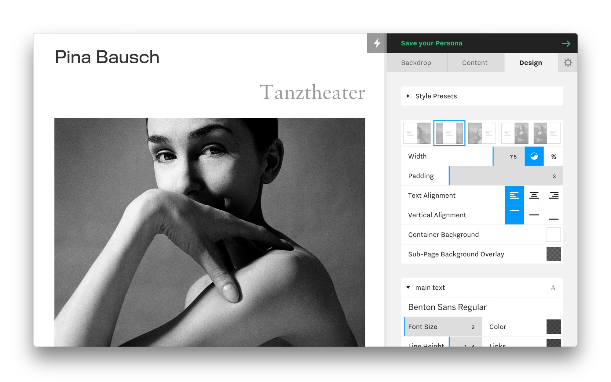

going to make this a little looser, maybe a little more personal than usual. typical find myself reflexively hesitating to share things, maybe to preserve keeping it just ambigious enough. anyway, who cares.

a quick overview of the past few months. tldr;

- released [persona.co](http://persona.co)
- collaborated w/ [folder studio](http://folderstudio.com) on projects like [2pac.com](http://2pac.com) and [east of borneo](http://eastofborneo.org)
- released the first version of [hardly everything](http://hardlyeverything.com)
- toured europe drumming w/ [anenon](http://brianallensimon.com).
- am now in ny and taking on freelance projects which overlap that fuzzy design/development zone.
- thinking about data ownership, service-free self-publishing, p2p-networks/post-cdn infastructure, and how all of this relates back to cultural projects & usable tools for people, etc…

## whats gone on

back in april of last year i was contributing to [persona](http://persona.co) with the team at [cargo](http://cargocollective.com), and saw it through to public release. there were a few heavy contributions, none of which would’ve been possible without the rest of the team.

- “base unit”, an abstract value used to create universal designs. sort of post-responsive design: using ratios derived from window proportion (not just width) with non-linear scaling to set a foundational integir applied to elements throughout a design. for instance, when the screen gets increasingly “phone sized”, reduce the margin around the page, but increase the point size of the body typography while reducing that of the headings. 

- the design of the admin, from overall look/feel to individual interface components and interactions. this included discovering ways of interacting with somewhat obscured tooling, such as base unit, while enabling the fidelity of control over design those familiar with cargo had come to expect over the years.

- whereas cargo had several unique designs, there is only a single persona design. this single design has styles, which are different configurations of that one design. i suppose this sounds like more of an implimentation detail, but it was a substantial rethinking of how to structure the page. sort of attempting to accomidate infinite permutation as opposed to specialized customization.

- creating a few customizable webgl backdrops, etc…

in december i toured europe playing drums with [brian allen simon](brianallensimon.com), aka anenon. def was a good time. touring is pretty tiring. i’ve done it on and off for a while, but easyjet/ryan air every other day for two weeks is rough. still, the shows were great.

some of the spots we stopped included [madeira](http://digitalinberlin.eu/), london, berlin (berghain kantine), brussels, the hauge, bordeaux, and luxembourg.

## what’s going on

- after completing persona i ended up working on a series of projects with my good friends at [folder studio](http://folderstudio.com). we’ve worked together on and off a number of years now. two projects which stand out are [2pac.com](http://2pac.com) and [eastofborneo.org](http://eastofborneo.org). continuing to do projects with them, some good stuff in the works.

- i’m in new york now. had been living in los angeles for several years. i wouldn’t say that i live here, but i wouldn’t say that i don’t live here, either. if you’re here and think there might be a project, or want to say hello, please do!

- devoting substantial time to the distributed web. data ownership and network infastructure.